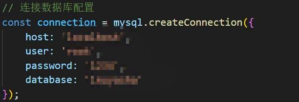
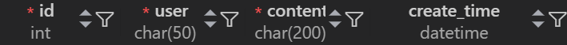
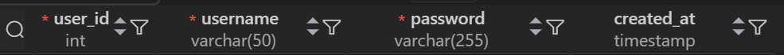

# 周杰伦网站使用说明

本网站借鉴了某个犬夜叉网站，记不得了，如果需要声明请联系我

## 环境准备

- **操作系统**: Windows 10
- **Node.js**: v18.18.0
- **MySQL**: v18.0.3.0

## 开发工具

- **IDE**: Visual Studio Code (VsCode)
- **VsCode 插件**:
  - MySQL v6.8.2
  - Live Server v5.7.9
  - Open in Browser v2.0.0
  - HTML CSS Support v1.13.1

## How to use

1、更改node.js中的内容，自己用Vs Code中创建的数据库来对应更改



创建的数据库需要包含

table：comments



table：users




2、启动服务器
在终端中进入到网站的根目录，运行以下命令以启动服务器:

```bash
node server.js
```


3、启动网页

使用 Visual Studio Code (VsCode) 打开 `login.html` 文件。然后，通过右键菜单选择 `Open with Live Server` 以在浏览器中打开网页。


4、畅快使用。
